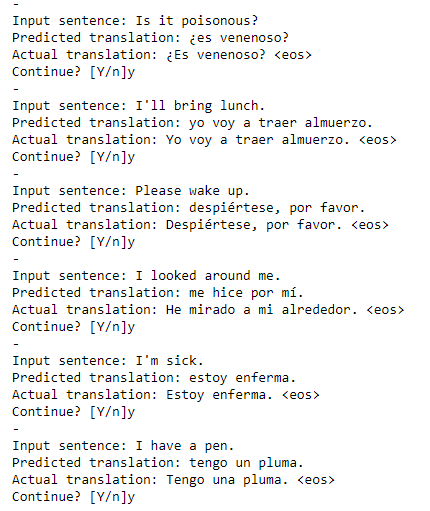

## Machine Translation

In this Project, I will be demostration English to spanish machine translation task using a LSTM based seq2seq model with Attention Mechanism. The whole model can be thought of as a seq2seq translation model with an Attention layer between the decoder and encoder. where Seq2Seq models can be thought of as an extention to normal seqence models which can be used when the seqence lengths of inputs and targets differ. Examples for such problems include machine translation, caption generation etc.

The basic architecture of such a model is as follows:

### The encoder
The encoder encodes the information from the input seqences into a single thought vector. This thought vector is nothing but the final hidden state of the encoder LSTM network. Here, we do not need the entire output from the LSTM but just the final hidden state. The encoder network, as the name implies is similar to the auto encoders that are used to learn representations of inputs without providing a target labels to train on.

#### The decoder
The decoder is the second LSTM network used in the seq2seq models. As the name suggests it decodes the information recieved from the encoder. The final hidden state from the encoder is used as the inintial hidden state of the decoder. The structure of a basic decoder LSTM is more or less similar to the LSTM used in the poetry generation example. The difference here is that, instead of using our own custom initial states, we will be using the finial states of the encoder as the initial states of the decoer. Again, we will be using teacher forcing to train the decoder network

Note:
A critical and apparent disadvantage of this fixed-length context vector design is incapability of remembering long sentences(vanishing gradient problem). Often it has forgotten the first part once it completes processing the whole input. The attention mechanism was born (Bahdanau et al., 2015) to resolve this problem.

### Attention
 the encoder works as similar to encoder-decoder model but the decoder behaves differently. Here the decoder’s hidden state is computed with a context vector, the previous output and the previous hidden state and also it has separate context vector c_i for each target word. These context vectors are computed as a weighted sum of activation states in forward and backward directions and alphas and these alphas denote how much attention is given by the input for the generation of output word.

 Sample output from model are shown in below image

